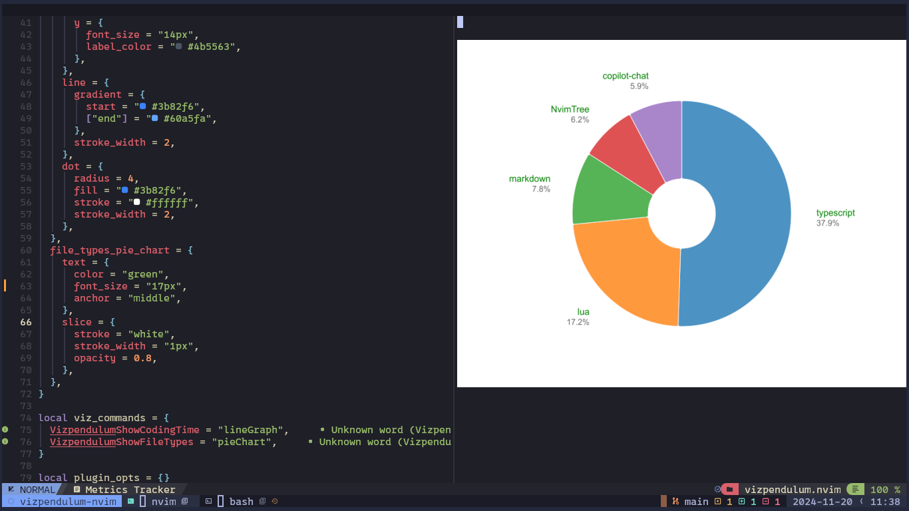
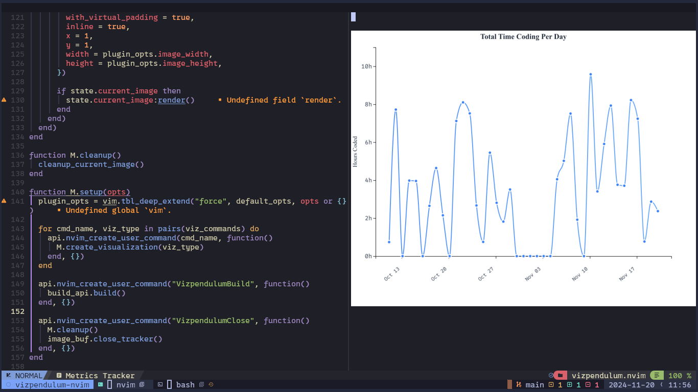

# VizPendulum.nvim

A Neovim plugin for visualizing coding metrics collected by [pendulum.nvim](https://github.com/link-to-pendulum). Create beautiful, interactive visualizations of your coding time and patterns directly within your editor.





## Features

- 📊 Real-time visualization of coding metrics
- 📈 Line graphs showing coding time trends
- 🥧 Pie charts for file type distribution analysis
- 🎨 Customizable visualization styles
- 🪟 Dedicated split window for visualizations

## Prerequisites

- Neovim >= v0.10.2
- [pendulum.nvim](https://github.com/ptdewey/pendulum-nvim) installed and configured
- Node.js and npm installed
- [image.nvim](https://github.com/3rd/image.nvim) for image rendering

## Installation

Using [lazy.nvim](https://github.com/folke/lazy.nvim):

```lua
{
    "CleoKiama/vizpendulum.nvim",
    dependencies = {
        "3rd/image.nvim",
        "ptdewey/pendulum-nvim",
    },
    config = function()
        require("vizpendulum").setup({
            -- optional configuration
        })
    end
}
```

Using [packer.nvim](https://github.com/wbthomason/packer.nvim):

```lua
use {
    "username/vizpendulum.nvim",
    requires = {
        "3rd/image.nvim",
        "username/pendulum.nvim"
    },
    config = function()
        require("vizpendulum").setup({
            -- optional configuration
        })
    end
}
```

## Configuration

```lua
require("vizpendulum").setup({
    -- Path to pendulum-nvim log file
	log_file = vim.fn.expand("$HOME/pendulum-log.csv"),

    image_width = 720,
    image_height = 500,

    line_graph = {
        background = "#ffffff",
        border_radius = "15px",
        text = {
            color = "#1f2937",
            font_size = {
                title = "18px",
                regular = "14px",
            },
        },
        axis = {
            x = {
                font_size = "12px",
                color = "#4b5563",
            },
            y = {
                font_size = "14px",
                label_color = "#4b5563",
            },
        },
        line = {
            gradient = {
                start = "#3b82f6",
                ["end"] = "#60a5fa",
            },
            stroke_width = 2,
        },
        dot = {
            radius = 4,
            fill = "#3b82f6",
            stroke = "#ffffff",
            stroke_width = 2,
        },
    },

    file_types_pie_chart = {
        text = {
            color = "green",
            font_size = "16px",
            anchor = "middle",
        },
        slice = {
            stroke = "white",
            stroke_width = "1px",
            opacity = 0.8,
        },
    },
})
```

## Usage

VizPendulum provides the following commands:

- `:VizpendulumShowCodingTime` - Display a line graph of your total coding time
- `:VizpendulumShowFileTypes` - Show a pie chart of file type distribution
- `:VizpendulumClose` - Close the visualization window
- `:VizpendulumBuild` - Rebuild the typescript files (Run this command after updating the plugin)

### Keybindings

- `q` - Close the visualization window

VizPendulum works by:

1. Reading metrics data from pendulum.nvim's log file
2. Processing the data using Node.js for visualization generation
3. Rendering SVG visualizations in a dedicated Neovim buffer using image.nvim

## Contributing

Contributions are welcome! Please feel free to submit a Pull Request.

## License

MIT

## Acknowledgments

- [pendulum.nvim](https://github.com/ptdewey/pendulum-nvim) for the metrics collection
- [image.nvim](https://github.com/3rd/image.nvim) for the image rendering capabilities
